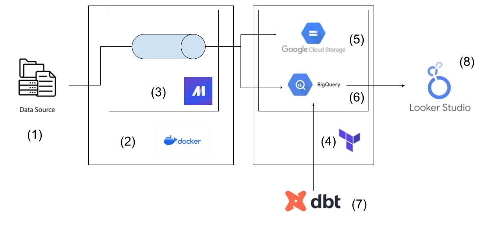

# Historical Wildfires in Alberta
## Overview:
This project uses open city wildfire data to story tell.
The motivation behind this project is to extract insights by looking at historical fire causes over the years.
As wildfires effect the health of the overall population, its become increasingly important to monitor and understand fires and their various causes, including human error.

## Objective:
* Extract historical wildfire data
* Transform & Load the data into a Data Lake
* Provide insights, reports to support data-driven decisions

## Data Sources:
#### Historical Wildfires:
[Alberta Historical Wildfire Data](https://open.alberta.ca/opendata/wildfire-data)

#### Active Wildfires:
[Natural Resources Canada](https://cwfis.cfs.nrcan.gc.ca/datamart/metadata/activefires)

## Architecture:


1. Open City Data
2. Dockerized Mage orchestrator
3. Orchestration: Python ETL Pipeline in Mage
4. Automated Infrastructure as code: Terraform
5. Data Lake: Google Cloud Storage Bucket
6. Data Warehouse: BigQuery
7. Data transformations & Model building: DBT Cloud
8. Reporting & Visualization

## Tools:
1. **Infrastructure Setup:** Terraform to build Cloud Storage and BigQuery resources.
2. **Environment:** Python, Docker
3. **ETL Pipeline:**
   * Extract data: Open City historical fire data
   * Transform data: transform to Pandas Dataframe from Excel spreadsheet
   * Load the Data: into Data Lake (GCS) and Data Warehouse (BigQuery) 

4. **Orchestration:** using Mage to orchestrate the ETL pipeline
5. **Containerization & Deployment:** Dockerized the ETL pipeline for scalability
6. **Data Warehouse:** Use DBT perform consistent and stable transformations to build a historical fact table
7. **Visualization:** I made a Looker Studio Historical Fires Report
8. **Automation:** using Mage, and DBT to enforce data freshness

# Project Details

## Data Ingestion:
Simple pipeline of an API loader
Loading into Data Warehouse and Data Lake
  
```Mage```: Orchestration
* A simple column name transformation was used because the data was messy
  * Column name erroneously named ``` "`" ``` which is an illegal character in BigQuery.
* Upon further investigation and referring to the data dictionary, this column should be named ```"true_cause"```
 

## Data Warehouse
```BigQuery``` first inspection


## DBT:
Building a model using seed data and wildfire data to a final fact table for historical fire data.  
DBT applies scalable and testable transformations to the data, and jobs to ensure the data is fresh.

```DBT Model```


### Seed Data
#### Fire Weather Index
Obtained from Alberta's Open City Data. It was presented as a non-text friendly pseudo-table, so the table had to be reconstructed manually:
* OCR to extract text
* LLMs to process and transform text
* formatted as CSV
* Ultimately ended up not using this, but documentation of steps is important
https://open.alberta.ca/publications/fire-weather-index-legend

#### Fire Number to Forest Area
Constructed a separate table of Fire Number data based on text descriptions found in the data dictionary.  
This will be inner-joined with the main table to provide detailed wildfire location names.


## Visualization


# Instructions
## 0. Preparation
clone the project
```
giit clone git@github.com:Dada-Tech/wildfires-pipeline.git
```
## 1. Google Cloud
* Create an account
* Generate Credentials for service account
  * Roles: BigQuery Admin, Storage Admin, Storage Object Admin, Actions Viewer 
* Save the key to the /keys, it will be referenced later

## 2. Dev Environment
* **gcloud** for CLI operations
* **docker**: for container orchestration
* **terraform** for GCP setup

## 3. Terraform
Variables are stored and used from previous steps here in the ```variables.tf``` file
* credentials: Service account json credentials
* project: GCP project name
* bucket_name: GCS bucket name
* BQ_DATASET: BQ dataset name
* region: GCP data region

## 4. Mage
A simple Dockerfile is used to build a mage container.
Ensure your key is saved to ./keys because that will be a local volumne mount

```docker compose up -d```

## 5. DBT
* Create a dbt account for Cloud use
* Connect to your repo
* Automate via Job creation or CI/CD